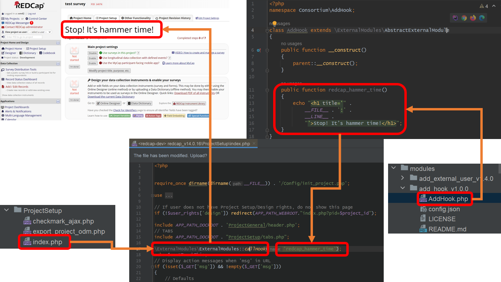

# Proposing New Hooks

We need your help making REDCap even more extensible!  If you encounter a need to customize REDCap in a new way that is currently difficult or impossible, please consider proposing that a new hook be added to REDCap's source code.  Please keep in mind that new hooks will only be available in External Modules, where [Framework Versioning](versions/README.md) allows behavioral changes going forward while ensuring full backward compatibility.

## Background Information
A REDCap hook is a predefined instruction that acts as an entry point into the REDCap core code for including additional functionality.
The External Module Framework incorporates means for having a method, within a custom build external module, be the process a hook must execute.
In other words, the actual hook is a predefined method within the External Module framework
(it's called "callHook" and it's shown below.) It is the callHook method that must be used and leveraged for adding new functionality to REDCap.

In order to successfully add a new hook there are several steps and requirements that must be met. 
First and foremost, it is critical to identify the spot in the REDCap core code (entry point) where the new hook is needed.
As a first step, familiarize yourself with the backend code that's driving the functionality you're hooking into, 
and take note of the parameters that are available - they prove useful later on (i.e. project id, record, event id, DAG, etc.) 
Then, add the callHook method, as described below, to the spot on the REDCap core code you've identified. 
Second, create a new external module and build a new method in it with a named prepended with "redcap_". Make sure you use this method's name as the hook name being called by the callHook method.
Finally, test the file, where the hook was added, and ensure it doesn't break the existing REDCap functionality.
A simple test is to load the page on which the new hook is being executed and ensure REDCap still works as expected (see below for additional details).

## Instructions
1. Add the hook to the REDCap source on your localhost using a code block like the following:
    ```
    \ExternalModules\ExternalModules::callHook('redcap_module_your_new_hook_name', [
      $project_id,
      $some_parameter,
      $some_other_parameter,
    ]); 
    ```
1. Add the new hook method to the module you're working on, and fully test it make sure it works as you would expect in your use case(s).
1. Now that you've finished testing, reconsider the following with all developers in the consortium in mind:
    1. The hook's name
    1. Parameters (if any) that would be appropriate to pass to this new hook.  In addition to your current use case, please try to imagine likely future use cases.  With the exception of `$project_id`, please avoid global parameters that can & should be accessed via module methods (e.g. `$module->getRecordId()`, `$module->getUser()`, etc.)
    1. A return value (if appropriate)
1. Email `mark.mcever@vumc.org` the new hook line, and the location where it needs to be added to the REDCap source. A copy/paste including surrounding lines is generally the easiest way to communicate this.  Alternatively, PRs are welcome if you happen to have access to REDCap's source repo.
1. Create a PR for this repo that documents the new hook in the list on [this page](hooks.md)

## Basic Example

The following example shows a summary for adding a new hook. It shows that adding the External Module callHook method to a
REDCap core code file can successfully run a method in an External Module and inject it onto a REDCap page. The example is using the ProjectSetup/index.php file
and it's calling a custom build method (called "redcap_hammer_time") in an external module. Adding a new hook is more of a configuration task as all that is required is locating the right location in REDCap's source code to execute the code supplied by a method in an External Module. Three things must be carefully considered.
1. Is this the correct location in the core code?
1. Does the new hook name precisely identify when it will execute (Example: redcap_every_page_before_render)? 
1. What variables can and should be passed to External Module method? (Example: redcap_every_page_before_render ( int $project_id )  


The basic example shown above can be found [here](https://redcap.vanderbilt.edu/community/post.php?id=227283&comment=227715).


## Additional Items to Consider

1. Regarding the use of the callHook method: 
   1. Work on a dev-environment as you're working towards finding the right core code file in which the new hook must be added.
   1. Test regularly, by looking for exceptions on the UI or on the server log, and make sure REDCap's expected functionality remains.
1. Regarding the new method (in an external module) used by the callHook method:
   1. The module config.json file must have a minimum framework version of 12.
   1. The new method, being reference by the callHook method, must be prefixed with "redcap_".
   1. The new method is not allowed/expected to have a return value.
   1. The module doesn't need to be enabled on all project by default for its method to be used by the callHook method.


## The Trajectory of Hooks Over Time
The REDCap ecosystem could be compared to the WordPress ecosystem when it comes to the frequency of customization.  It is possible that the number of hooks in REDCap could increase significantly over time, as it has in WordPress.  See the graph at the bottom of [this page](https://adambrown.info/p/wp_hooks) to get a feel for how the number of WordPress hooks has increased since it was created in 2004.
